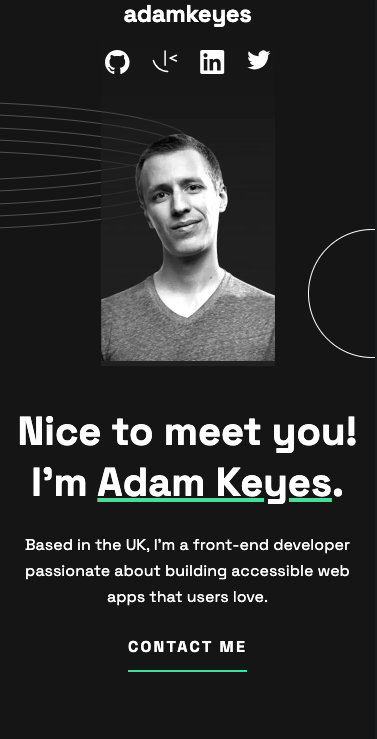
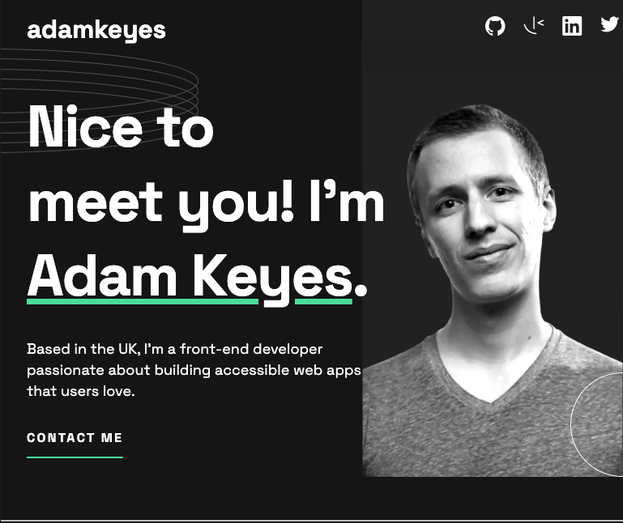
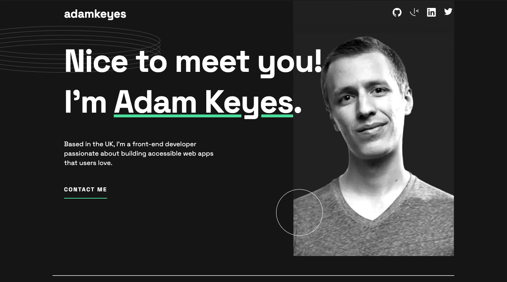

# Single-page developer portfolio solution

This is my solution to the [Single-page developer portfolio challenge on Frontend Mentor](https://www.frontendmentor.io/challenges/singlepage-developer-portfolio-bBVj2ZPi-x).

## Table of contents

- [Overview](#overview)
  - [The challenge](#the-challenge)
  - [Screenshot](#screenshot)
  - [Links](#links)
- [My process](#my-process)
  - [Built with](#built-with)
- [Author](#author)

## Overview

### The challenge

Users should be able to:

- Receive an error message when the `form` is submitted if:
  - Any field is empty
  - The email address is not formatted correctly
- View the optimal layout for the interface depending on their device's screen size
- See hover and focus states for all interactive elements on the page

### Screenshot

  
  

### Links

- Solution URL: [https://github.com/kateneilsen/svelte-developer-portfolio](https://github.com/kateneilsen/svelte-developer-portfolio)
- Live Site URL: [https://svelte-developer-portfolio.vercel.app/](https://svelte-developer-portfolio.vercel.app/)

## My process

### Built with

- Svelte
- Javascript
- Semantic HTML5 markup
- CSS custom properties
- Flexbox
- CSS Grid
- Mobile-first workflow

## Author

- GitHub - [@kateneilsen](https://www.github.com/kateneilsen)
- Frontend Mentor - [@kateneilsen](https://www.frontendmentor.io/profile/kateneilsen)
